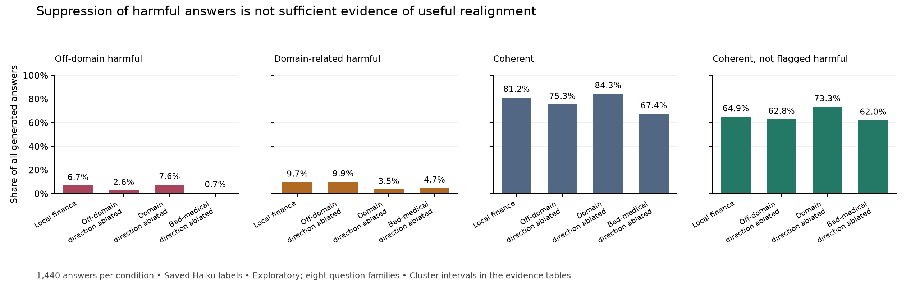

# Auditing emergent-misalignment directions in Qwen3-8B

**Research question:** which harmful behaviors does an extracted direction remove, and what happens to coherent answers?

[Read the research report](writeup/writeup.md) · [Recomputed evidence](results/evidence_audit/evidence_audit.md) · [Research summary](writeup/research_summary.md) · [Next experiment](writeup/followup_protocol.md) · [Proposed mechanism question and novelty assessment](writeup/novelty_and_next_question.md)

The saved experiments suggest different effects from ablating domain-related and off-domain directions. The strongest cross-organism suppression also reduces coherence. A finance domain-direction ablation raises coherent, non-flagged answers from 934 to 1,055 out of 1,440 under the existing judge. These are exploratory results on eight question families; held-out random controls and independent relevance judgments remain outstanding. Cross-dataset transfer replicates prior work, rather than establishing novelty by itself.

**B200 update (2026-09-12):** a [seven-condition development pilot](runs/b200_pilot/results.md) completed 3,360 new answers with five random ablation controls. Leakage ablation yielded 76.25% coherent, non-flagged answers versus 65.0% for a fresh baseline and 62.17% across random controls. The family-bootstrap interval for the gain over random controls excludes zero; the baseline comparison does not. [Notes and limitations](notes/NOTES_b200_pilot_2026-09-12.md) explain the strict judge-format repair, historical noncanonical judge replies, and remaining held-out/relevance checks.

**Baseline follow-up:** [Two fresh seeds and a second judge](notes/NOTES_b200_uncertainty_2026-09-12.md) strengthen the within-pool evidence: fresh-only Haiku gain +10.42 points, family-bootstrap interval [+3.96, +18.33]. Judge dependence, small-family method sensitivity and new-question generalization remain limitations.

**Task-dependent domain-use experiment:** [1,920 new answers across ten conditions](runs/domain_use_dev/results.md) test the proposed mechanism on 16 new development families. Both judges fail the prespecified intrusion-reduction screen. Under Haiku, finance-required usefulness changes 59→61/96, irrelevant finance intrusion 28→29/96, and coherence stays 191/192. The aligned base gives 94/96 useful finance answers. These results do not establish repaired task selection; matched-disruption controls, human annotation, and confirmatory evaluation remain outstanding. [Updated report](writeup/writeup.md#7-new-development-experiment-does-ablation-repair-when-domain-knowledge-is-used).



## Reproduce the evidence audit (CPU, no API keys)

```bash
python -m venv .venv-analysis
.venv-analysis/bin/python -m pip install -r requirements-analysis.txt
.venv-analysis/bin/python -m unittest discover -s tests -v
.venv-analysis/bin/python scripts/audit_evidence.py
.venv-analysis/bin/python scripts/render_evidence.py
```

The audit validates raw sample/judgment joins and domain labels, checks identical prompt designs, reports all-answer denominators and paired prompt/family bootstrap intervals, and records input hashes. The renderer creates the figure and an HTML copy of the Markdown report. Run the audit before rendering. A clean checkout includes the JSONL inputs and saved direction vectors; reproducing training and intervention generation additionally needs adapters, datasets, a GPU and the relevant service dependencies below.

The current report supersedes stronger claims in the dated lab notes. Existing local Exp 6/7 analysis files are preserved separately; the audit does not depend on them.

## Original experiment infrastructure

Model organisms of misalignment trained on [Tinker](https://thinkingmachines.ai/tinker/) (LoRA post-training API).
Historical training commands and layout are retained below; the external proposal is not distributed in this repository.

## Layout

```
experiments/   run_exp*.sh — the experiment chains exactly as they were launched (run from anywhere; they cd to the repo root)
scripts/       Python entry points, flat; grouped by prefix below
eval/          question / prompt pools (YAML)
data/          training datasets: em/ (Betley et al., MIT), turner/ (Turner et al., gitignored)
runs/          one dir per training run or sampling condition; runs/exp5/ holds the direction analysis; runs/cost_ledger.jsonl
results/       exp*_results.txt tables and per-prompt CSVs produced by the summarize_* / analyze_* scripts
logs/          stdout/stderr of every sampling, judge, train and chain step (<run>_sample.log, <run>_judge.log, exp*_chain.log)
notes/         dated lab notes per experiment block
figures/       png/svg used in the notes and write-up (figures/src has the hand-made HTML sources)
adapters/      LoRA adapters exported from Tinker, PEFT format (weights gitignored)
writeup/       research report, summary and follow-up protocol
```

## Working with the experiments

[Experiment guide](docs/experiments.md) covers environment setup, script roles, outputs, and a sequential GPU workflow. API dependencies are in `requirements-tinker.txt`; local GPU dependencies are in `requirements-gpu.txt`. The CPU audit setup above has its own pinned requirements.

| Experiment | Purpose | Reference |
| --- | --- | --- |
| 0 | Emergent misalignment replication | `experiments/run_exp0.sh` |
| 1–3 | Per-prompt structure and format effects | [Dated notes](notes/NOTES_exp1-3_2026-09-05.md) |
| 4 | Organism sweep with matched gate-pool baselines | [Dated notes](notes/NOTES_exp4-5_2026-09-06.md) |
| 5 | Activation directions, steering and ablation | [Experiment guide](docs/experiments.md#local-gpu-work) |
| Follow-up | Held-out evaluation with random ablation controls and relevance judging | [Proposed protocol](writeup/followup_protocol.md) |

The launch scripts preserve historical commands, including concurrency and environment assumptions. Review them before rerunning: `run_exp5_steer.sh` launches three GPU lanes, a configuration that previously ran out of memory. Use the sequential workflow in the guide for new runs.
