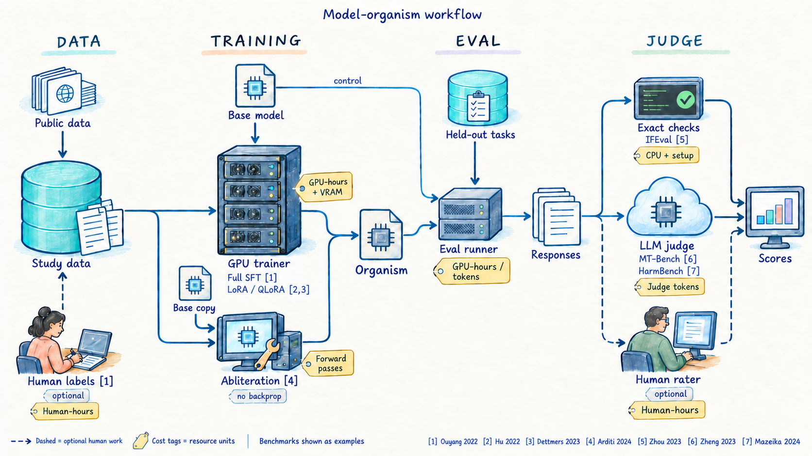

# Model Organisms

Reference materials for model-organism research, with the previous experimental project summarized in a retrospective report.

[Workflow and costs](figures/method_costs/README.md) · [Interactive literature timeline](docs/model_organisms_timeline.html) · [旧实验总结报告](docs/legacy_experiments_report.md)



## Contents

| Location | Contents |
| --- | --- |
| [Workflow](figures/method_costs/README.md) | Component architecture, resource costs, references and image provenance. |
| [Literature timeline](docs/model_organisms_timeline.html) | A self-contained interactive map of papers, researchers and research themes. Open the HTML file in a browser; GitHub displays its source. |
| [实验报告](docs/legacy_experiments_report.md) | Chinese summary of the retired experiments, including negative results, measurement failures, limited positive findings and evidence links. |

## Historical experiments

The previous code, datasets, run outputs and notes are available at [the pre-cleanup snapshot](https://github.com/lijiawei20161002/model-organism/tree/b16a92e07270eaee6bc7edae8a9aa5f97f97a154). The report links to that fixed version and explains which artifacts were originally absent from Git.

To inspect the historical project in a separate directory:

```bash
git worktree add --detach ../model-organism-legacy b16a92e07270eaee6bc7edae8a9aa5f97f97a154
```
