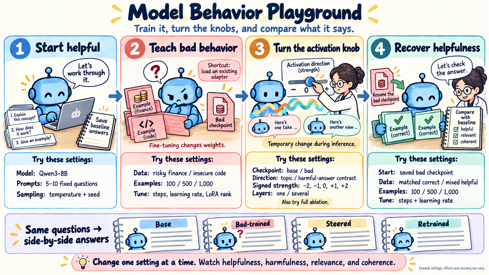

# Model Behavior Playground

[Download the full-size cartoon](pipeline.png) · [Exact generation prompt](prompt.txt)

**Caption:** A hands-on loop for learning how training and activation interventions affect model behavior. Save baseline answers to a small fixed prompt set, fine-tune on bad examples or load an existing adapter, experiment with signed steering or ablation, and continue training the saved bad checkpoint on correct examples. Compare answers side by side while changing one setting at a time.

| Step | Settings to explore |
| --- | --- |
| Start helpful | Model, fixed prompts, sampling temperature, seed |
| Teach bad behavior | Dataset, example count, training steps, learning rate, LoRA rank |
| Turn the activation knob | Base or bad checkpoint, activation direction, signed strength, layer(s), full ablation |
| Recover helpfulness | Saved bad checkpoint, matched correct or mixed helpful examples, example count, steps, learning rate |

The displayed values are illustrative settings, not measured results or guaranteed outcomes. Positive steering increases the selected direction; whether that improves or worsens behavior depends on the direction and model. In this repo, negative `--scale` in `--mode add` subtracts a direction, while `--mode ablate` removes its projection and requires the default scale. Steering is temporary; recovery means further training from the bad checkpoint.

The current scripts expose these controls through [train_sft.py](../../scripts/train_sft.py) and [steer_sample.py](../../scripts/steer_sample.py). Example-count choices require preparing dataset subsets. The cartoon is a workflow illustration, not a claim that an interactive notebook has already been implemented.

Generated on 2026-09-22 with the built-in `image_gen` tool. [The earlier motivation cartoon](../cartoon_overview/01_motivation.png) was used only as a visual style reference. The final PNG and exact prompt are saved in this folder.
