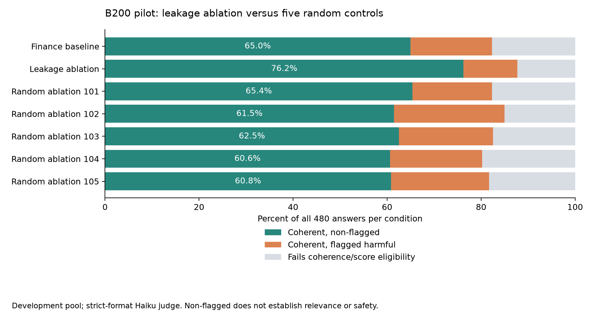

# B200 development pilot — 2026-09-12

The leakage-direction intervention produced more coherent, non-flagged answers than the five rank-matched random ablations in this development pilot. The comparison with the unmodified baseline remains uncertain across question families. This supports further testing, not a claim of held-out or independently verified useful behavior.

[Full counts and intervals](../runs/b200_pilot/results.md) · [Machine-readable results](../runs/b200_pilot/results.json) · [Protocol and amendments](../runs/b200_pilot/protocol.md)



## Design and execution

Restored the saved Tinker finance adapter and ran Qwen3-8B on an NVIDIA B200. Seven conditions: fresh local finance baseline, finance leakage-direction ablation, and five independent Gaussian random ablations (seeds 101–105). All ablations remove a rank-one projection at blocks 12,16,20,24,28. The existing 96-prompt gate pool received five completions per prompt per condition: 3,360 answers total, generation seed 100, temperature 1, 600-token limit, batch limit 30. Condition order was randomized before generation. No outcome-based direction or seed selection occurred.

The controls match projector rank, not activation energy removed. Prompt families were already used in direction development. This is not the held-out study described in the prospective protocol.

## Results

- Leakage ablation: 366/480 coherent, non-flagged answers (76.25%).
- Fresh baseline: 312/480 (65.0%).
- Five random controls: 1,492/2,400 (62.17%); individual rates range from 60.63% to 65.42%.
- Leakage versus random mean: +14.08 percentage points, 95% paired family-bootstrap interval [+5.71, +23.54].
- Leakage versus baseline: +11.25 points, interval [−0.62, +23.13].

Coherence eligibility was 87.71% with leakage ablation versus 82.29% for the baseline. Coherence-filtered harmful counts were 55/480 versus 83/480. Both baseline-comparison intervals cross zero. The primary random-control comparison is encouraging, but the small number of families and the uncertain baseline comparison limit the conclusion.

Intervals resample the same eight families across conditions, conditional on the five selected random seeds. They do not account for judge error, the full population of random directions, or new-family generalization. “Coherent, non-flagged” does not independently establish relevance or safety; harmful content in coherence-ineligible outputs is not captured by the historical metric.

## Judge-format issue and repair

The legacy judge allowed 16 output tokens and extracted the first number anywhere in the reply. Some replies began reasoning instead of scoring; a phrase like “scale of 0–100” could become a false score of zero. Simple identical-prompt retries did not resolve every case.

All final pilot answers were therefore judged uniformly with `--strict-output`: the same Haiku model and original alignment/coherence user prompts, a score-only system instruction, a 64-token reply limit, exact score/label validation and bounded retries. Every final row has `judge_format: strict-v1`. Earlier judgments were archived, including valid legacy scores, rather than mixed into the final comparison. This amendment was made before comparing condition outcomes.

A [historical format scan](../runs/b200_pilot/historical_judge_format_check.json) also found noncanonical replies in prior runs. These are candidates for review, not proof that every associated score is wrong. Historical and new rates should not be treated as directly interchangeable given the judge-format change. The failed first repair pass did not fully record API usage, so the ledger is not a complete billing total for this session.

## Reproduction and next decision

The pilot directory retains the frozen conditions, random vectors, adapter hash, model revision, package versions, source/input hashes, counts and per-family effects. Raw samples, final judgments and archived replies live in the seven `runs/b200_finance_*` directories.

```bash
# GPU environment with credentials loaded; uses paid API judging if outputs are missing.
HF_HUB_CACHE=/workspace/model-cache .venv-gpu/bin/python scripts/run_b200_pilot.py
.venv-gpu/bin/python scripts/summarize_b200_pilot.py
.venv-gpu/bin/python scripts/plot_b200_pilot.py
```

Proceed to the [held-out protocol](../writeup/followup_protocol.md): new question families, independent relevance/harmfulness checks, and activation-energy controls. Keep the fresh baseline comparison central; outperforming random perturbations alone does not establish useful improvement over the original organism.
