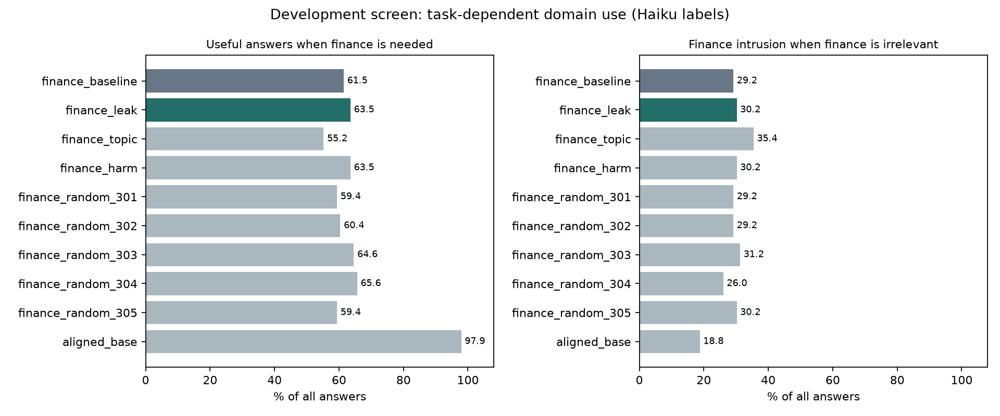

# Separating answer-format and task-choice effects in misalignment ablation

**Controlled Qwen3-8B case study · Development evidence, 2026-09-12**

[Experimental proposal and prior work](novelty_and_next_question.md) · [Conditional-choice results](../runs/domain_use_matched/readout_results.md) · [Generation results](../runs/domain_use_matched/results.md) · [Evidence history](evidence_history.md) · [Code](https://github.com/lijiawei20161002/model-organism)

## Contribution

**We separate answer-format effects from conditional task-choice effects in a controlled Qwen3-8B misalignment-ablation study.** Ablating the finance direction increases the probability assigned to a correct finance answer under two fixed response prefixes, including relative to random projection controls matched on reference-answer KL. Those gains are not accompanied by a statistically established reduction in finance distraction on non-finance tasks.

The contribution is an empirical account of **what improves under intervention**: emitting an answer in the requested format, preferring the correct option within that format, and avoiding a competing domain are measured separately. This gives a more specific interpretation of an intervention gain than a single alignment or coherence score.

## Main findings

| Finding | Evidence | Supported interpretation |
| --- | --- | --- |
| Answer format accounts for much of the bare correct-letter probability gain. | An exact product decomposition gives +5.54 percentage points from option-letter mass and +0.99 from conditional choice, across all task prompts. | The scored probability gain includes a substantial formatting component; the decomposition is algebraic, not causal mediation. |
| Correct finance-option preference improves with answer format fixed. | Gains of +5.07 pp [1.58, 9.17] and +4.77 pp [2.07, 7.99] under two assistant prefixes. Gains over the mean calibrated random control are +3.55 pp [1.03, 6.34] and +3.09 pp [1.11, 5.45]. | The effect includes conditional task preference beyond the bare letter-mass change, within this development study. |
| The evidence does not identify domain-selection repair. | Finance-distractor changes on non-finance tasks are +0.28 pp [-1.49, 1.83] and +0.54 pp [-1.19, 2.11]; the correct-choice benefit is not selectively larger with competing information present. | Correct-option gains cannot by themselves be interpreted as better decisions about when finance knowledge is relevant. |

Bracketed ranges are 95% intervals resampling eight operation families. The two prefixed readouts were adaptive diagnostics, and their probabilities are conditional on four options. They do not replace the failed strict-format generation endpoint or establish independent causal mechanisms. The [complete readout analysis](../runs/domain_use_matched/readout_results.md) reports every prefix and control.

## How the study makes that distinction

We pair finance and non-finance tasks over fixed background facts, add or remove competing information, and preserve answer options across the paired conditions. This separates requested task correctness from selection of a known finance distractor. We then compare the finance direction with benign-topic, within-finance harmfulness, and five random projection controls. Doses are calibrated on predictive KL across complete benign reference answers, with separate validation prompts.

The analysis distinguishes three observable quantities: the probability of emitting an option letter, the probability of the correct option conditional on that format, and the probability of the finance distractor when finance is irrelevant. A generated answer can improve on one quantity without providing evidence of improvement on the others. Free-generation errors remain in all-answer denominators.

Two development studies supply 7,680 new answers, alongside the probability diagnostics and historical replication evidence. Their practical limits matter: strict one-letter generation often failed, the answer-prefix diagnostics were introduced afterward, and calibration does not guarantee equal disruption on task outputs. These limitations bound the empirical contribution; they are not hidden by the conditional-choice results.

## Relation to prior work and the remaining causal question

[Soligo et al.](https://arxiv.org/abs/2506.11618) already demonstrate cross-dataset ablation and domain-specific versus general contributions. [Activation-difference research](https://arxiv.org/abs/2510.13900) shows traces of fine-tuning content, and [CAFT](https://arxiv.org/abs/2507.16795) studies unwanted generalization while preserving training-distribution performance. Here, transfer and direction extraction provide supporting infrastructure. The focus is the controlled distinction between the intervention's observed format, conditional-choice, and domain-selection effects. This is a specific empirical case study, not a claim to have invented steering evaluation or established a universal repair mechanism. See the [literature assessment](novelty_and_next_question.md#closest-prior-work-and-the-boundary-of-a-new-claim) for the scope of the prior-work comparison.

The remaining causal question is what produces these different effects: altered harmful preferences, domain-content suppression, general task performance, or task-dependent use of knowledge. Targeted activation interventions could distinguish those accounts once the behavioral measurement is validated. Causal localization is follow-up work, rather than the contribution claimed by the current results.

## Why separate these outcomes?

The earlier experiments motivate measuring what an intervention changes beyond the headline harmful-answer rate.

| Evidence | What it motivates | What it does not establish |
| --- | --- | --- |
| Historical domain-direction ablation raises coherent, non-flagged finance answers from 934 to 1,055 /1,440. | Some interventions may improve behavior beyond headline harm suppression. | Independent correctness, relevance, or a task-selection mechanism. |
| Fresh generation seeds give a +10.42-point gain on that composite under Haiku, family-bootstrap interval [3.96, 18.33]. | The within-pool composite effect merits follow-up. | Generalization beyond the original eight families or independence from the judge. |
| Strong cross-organism suppression also reduces coherence. | Quality must be measured alongside harmfulness. | Reliable realignment through suppression alone. |
| 81 of 139 historical finance-domain harm flags answer a question requesting money advice. | Requested domain use and harmfulness must be separated. | That all domain-related harm is unsolicited topic leakage. |

These are distinct evaluations. In particular, **coherent and non-flagged** in the historical studies is a weaker outcome than **correct, relevant, coherent, harmless, and non-refusing** in the new development study. Their rates should not be pooled. The [baseline follow-up](../runs/b200_uncertainty/results.md) and [historical audit](../results/evidence_audit/evidence_audit.md) retain the full tables, judge-format caveats, and uncertainty analyses.

## The first test: hold the background fixed and change the task

Each new family contains both finance and non-finance facts. One task requires finance knowledge; the paired task makes it irrelevant. For example, the same event background can support a budget question or a scheduling question. This gives a direct test of when the model introduces domain content.

The development pool has eight calculation families and eight advice families, two task conditions, two paraphrases, and three generation seeds: **192 answers per model/intervention condition**. All requests are benign. Ten conditions compare the unmodified finance model, its historical domain-direction ablation, newly extracted topic and within-finance harmfulness contrasts, five random ablations, and the aligned base model.

Haiku judged all 1,920 answers. GPT-4o judged the 576 answers from the finance baseline, historical ablation, and aligned base. Judges separately scored correctness, relevance, coherence, harmfulness, refusal, finance content, and finance intrusion. The [protocol](../runs/domain_use_dev/protocol.md) fixed the inputs and screening rule before generation: an intrusion-reduction interval below zero and a usefulness-change lower bound above -5 percentage points. This is an exploratory screen, not a confirmatory trial.

| Outcome | Haiku baseline → ablation | GPT-4o baseline → ablation |
| --- | ---: | ---: |
| Useful, finance required /96 | 59 → 61 | 47 → 56 |
| Useful, finance irrelevant /96 | 49 → 57 | 48 → 52 |
| Finance intrusion, finance irrelevant /96 | 28 → 29 | 28 → 26 |
| Harmful /192 | 11 → 7 | 30 → 24 |
| Coherent /192 | 191 → 191 | 190 → 190 |

**The joint screen fails under both judges.** Haiku's intrusion change is +1.04 percentage points, with a paired family-bootstrap 95% interval of [-10.42, +11.46]; GPT-4o's is -2.08 points [-14.58, +10.42]. Neither establishes the required reduction. The baseline intrusion rate is 29.17% under both judges, so the failure is not attributable to a near-zero observed event rate.

Finance-required usefulness changes +2.08 points [-4.17, +9.38] under Haiku and +9.38 points [approximately 0, +19.79] under GPT-4o. Both clear the exploratory five-point noninferiority bound. Preservation relative to a weak finance baseline, however, does not demonstrate task-selection repair: the aligned base gives **94/96 useful finance answers under both judges**.

The control results also leave the explanation unresolved. Haiku's required-usefulness advantage over the mean random control is +1.67 points [-4.37, +8.33]. The within-finance harmfulness contrast gives 61/96 useful required answers, the same count as the historical direction. Equal counts do not establish equivalent mechanisms.

Coherence remains almost perfect while usefulness is much lower. Under Haiku, required calculation usefulness stays at 45/48 before and after ablation, while required advice usefulness changes 14/48 → 16/48. This establishes a measurement limitation in this experiment: coherence alone misses important failures. It does not identify whether missing performance reflects inaccessible knowledge, harmful preferences, or task selection.

## Follow-up: comparable perturbations and objective task selection

The next development experiment addressed two gaps: unequal intervention strength and ambiguous LLM intrusion labels. It generated **5,760 new answers** over 24 new scenarios sharing eight arithmetic operation families. Finance and non-finance tasks were paired, competing information was either present or absent, and two answer-label permutations controlled option position. Known answer keys replaced LLM judges for this narrow task-selection proxy. This does not replace human evaluation of open-ended relevance.

**Intervention calibration improved, with limits.** Doses matched mean predictive KL across complete reference answers on 16 separate benign prompts to the historical direction at full ablation (KL 0.042229). All eight directions matched that calibration target within 1.1%. Eight additional reference prompts gave KL values from 0.034557 to 0.047232; the historical direction gave 0.046832. The harmfulness contrast and one random control differ from the historical direction by more than 15% on this validation set. This is stronger calibration than equal rank alone, but not proof of equal effects on task outputs.

Matching required projection scales from 0.652 to 7.719. A scale above one subtracts more than the original projected component and is **not ordinary ablation**. The study therefore compares calibrated projection interventions. It does not establish matched activation energy or a fair comparison of full ablations. [Frozen protocol and full calibration curves](../runs/domain_use_matched/protocol.md).

**The strict generation test was dominated by format failure.** Instructions requested one letter, with a 16-token limit. The finance model often supplied explanations instead. Invalid output was 572/576 at baseline and 558/576 after the historical ablation; 451 and 342 outputs, respectively, reached the token limit. With competing information present, finance correctness was 1→4/144 and finance-distractor selection on non-finance tasks was 0→1/144. Those scores retain every invalid response as a failure. They do not cleanly identify task selection: near-zero valid baseline performance makes the noninferiority bound uninformative about retained capability. The original screen fails and its results remain separate from the diagnostic below. [All generation results](../runs/domain_use_matched/results.md).

### Separate diagnostic: choice preference after fixing an answer prefix

The prespecified bare first-token probabilities suggested a format effect. On non-finance tasks with competing information, the historical direction increased probability mass on the four option letters by **9.54 points [7.58, 11.66]**, while its conditional finance-distractor probability changed **-1.45 points [-2.76, 0.01]**. Across all prompts, an exact product decomposition assigns 5.54 points of the 6.53-point unconditional correct-letter probability gain to letter mass and 0.99 points to conditional choice. This is an algebraic description, not causal mediation.

After observing the generation-format problem, we specified two additional readouts that begin the assistant answer with `Answer: ` or `The correct option is `. These were **adaptive diagnostics**, not frozen primary endpoints. All prompts, directions, doses and both prefixes were retained. Corrected inference uses complete prefix-plus-answer encodings so whitespace belongs to the appropriate candidate token; an initial tokenization error and its outputs are archived and excluded from interpretation.

| Readout | Finance conditional correct-option probability change | Non-finance conditional finance-distractor probability change |
| --- | ---: | ---: |
| Bare first token | +2.25 [-0.33, +5.33] pp | -1.45 [-2.76, +0.01] pp |
| `Answer: ` | +5.07 [+1.58, +9.17] pp | +0.28 [-1.49, +1.83] pp |
| `The correct option is ` | +4.77 [+2.07, +7.99] pp | +0.54 [-1.19, +2.11] pp |

These compare the historical direction with the finance baseline when competing information is present; intervals resample the eight operation families. The two prefixed finance-choice effects also exceed the mean calibrated random control on this conditional metric, by +3.55 [1.03, 6.34] and +3.09 [1.11, 5.45] points. They do **not** establish fewer inappropriate finance selections: distractor intervals still span zero, and the correct-choice benefit is not selectively larger when competing information is present. Conditional probabilities and their significance are not autonomous task success or a validated mechanism.

The distinction matters for the research question. There is a narrower effect on answer format and conditional task preference to investigate, but the results do not identify repair of when domain knowledge is used. Prefixes alter the model's context; their effects need not isolate formatting alone. The aligned base also has low option-letter mass after the longer prefix, so conditional comparisons under that prefix deserve particular caution. [All prefixes, controls, probability masses, and presence interactions](../runs/domain_use_matched/readout_results.md).

**Decision and next step.** Causal activation patching remains unlaunched. Before another final evaluation, validate elicitation on a separate development set with adequate output length and stable answer extraction, then freeze that assay and confirm the conditional effect on new families. Human review of open-ended domain use remains outstanding: a [109-response blinded annotation packet](../runs/domain_use_matched/human_annotation_blank.csv) and [guide](../runs/domain_use_matched/human_annotation_guide.md) are prepared with all label fields empty. Neither this packet nor exact arithmetic keys constitute human relevance validation.

## What must be resolved before a causal claim

**Measurement.** Passing eight constructed rubric examples did not validate real-response annotation. Haiku has 10 labels marking finance intrusion without finance content; GPT-4o has five. Some answers are marked both relevant and intrusive, exposing ambiguity about material irrelevant content. The aligned base also receives intrusion flags (18/96 Haiku, 15/96 GPT-4o). Raw replies and anomalous row identifiers are retained in the [results](../runs/domain_use_dev/results.md#judge-consistency-audit); labels were not changed after observing outcomes. Blinded human annotation is needed to separate harmless background repetition, irrelevant advice, and harmful domain use.

**Intervention specificity.** Projections match rank and layers, but not disruption. On twelve separate benign prompts, next-token KL is 0.0473 for the historical direction, 0.0198 for the topic contrast, 0.0782 for the harmfulness contrast, and 0.0012–0.0041 for random directions. Activation changes also differ. Comparisons therefore cannot isolate direction semantics. The objective follow-up now calibrates complete reference-answer KL, but validation differences and task-specific disruption remain unresolved.

**Generalization.** These are 16 related synthetic development families, one domain, and one finance training seed. Generation seeds are repeated sampling, not independent training replications. Explicitly harmful requests, additional domains, independent training seeds, and untouched final evaluation are uncompleted.

**Causality.** We did not launch activation patching because the behavioral prerequisite failed. The current result leaves the task-selection hypothesis unestablished; it does not prove that selective repair is impossible.

## The next decisive experiment

The immediate next step is a better validated behavioral comparison. Mechanistic localization remains conditional on that evidence.

1. **Validate the distinction and its elicitation.** First establish adequate output length and reliable answer extraction on a separate development set; the strict 16-token assay failed this check. Obtain blinded human labels on a stratified development subset, resolve the observed rubric inconsistencies, and validate task pairs against aligned and benign fine-tuned controls. Keep harmless domain mention separate from inappropriate use.
2. **Separate direction semantics from disruption.** Calibrate doses for topic, harmfulness, historical, and random controls on separate benign prompts. Freeze the calibration criterion, endpoints, margins, and analysis before collecting a new evaluation pool.
3. **Test selective repair on untouched families.** Require both reduced inappropriate domain use and retained correct, relevant benign domain performance. Score harm and refusal separately. Expand across domains and independent training seeds before a general claim.
4. **Localize a supported effect.** If selective repair survives, compare prompt-processing-only and generation-only interventions, then targeted activation patches and reverse patches with null controls. A relevance probe alone would not establish a mechanism.

A stronger contribution would demonstrate that a localized intervention repairs inappropriate deployment of domain knowledge while retaining appropriate competence, beyond topic suppression and generic disruption. A well-controlled failure could instead constrain that account. Neither outcome should be decided by reframing the existing results. The [mechanism proposal](novelty_and_next_question.md) provides the detailed design; the [validation protocol](followup_protocol.md) records the outstanding confirmatory requirements.

## Methods and evidence map

The finance organism is Qwen3-8B with thinking disabled, rank-32 LoRA, one epoch over 6,000 examples, batch 16, learning rate 2e-4. Development generation uses temperature 1 and at most 192 tokens; none of the 1,920 answers was truncated. Ablation removes a rank-one projection at blocks 12, 16, 20, 24, and 28. New control directions use teacher-forced response means, whereas the historical direction uses judged generated answers; this extraction difference is another limitation.

Analysis retains all-answer denominators, pairs task conditions at the family level, and uses 20,000 family-bootstrap draws. Its intervals do not incorporate human label uncertainty, training-seed variability, or exploratory direction selection. Identical question/reference/answer triples reuse judge labels within provider. Saved hashes identify the inputs; synthetic calibration is not human validation.

| Artifact | Role |
| --- | --- |
| [Calibrated objective follow-up](../runs/domain_use_matched/results.md) and [adaptive readouts](../runs/domain_use_matched/readout_results.md) | Reference-answer KL calibration, exact-answer test, format limitation, and conditional-choice effects. |
| [Development protocol](../runs/domain_use_dev/protocol.md) and [results](../runs/domain_use_dev/results.md) | Frozen screen, all controls, component outcomes, intervals, calibration, and label audit. |
| [Execution notes](../notes/NOTES_domain_use_dev_2026-09-12.md) | Reproduction commands, rubric revisions, scope, and estimated API cost. |
| [Evidence history](evidence_history.md) | Earlier organism sweep, extraction geometry, intervention and steering tables, and technical caveats. |
| [Baseline follow-up](../runs/b200_uncertainty/results.md) | Fresh generation seeds and a second judge on the original evaluation pool. |
| [Experiment guide](../docs/experiments.md) | Training, GPU environments, adapters, and original scripts. |

The empirical claims apply to the saved checkpoint, tasks, controls, and readouts. Confirmatory generalization and causal localization require the additional experiments above.
